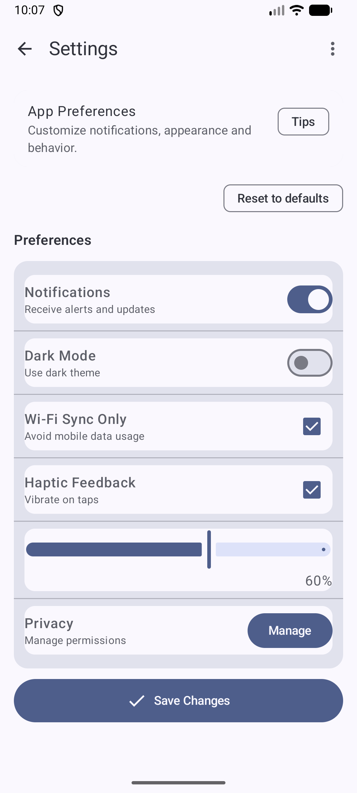
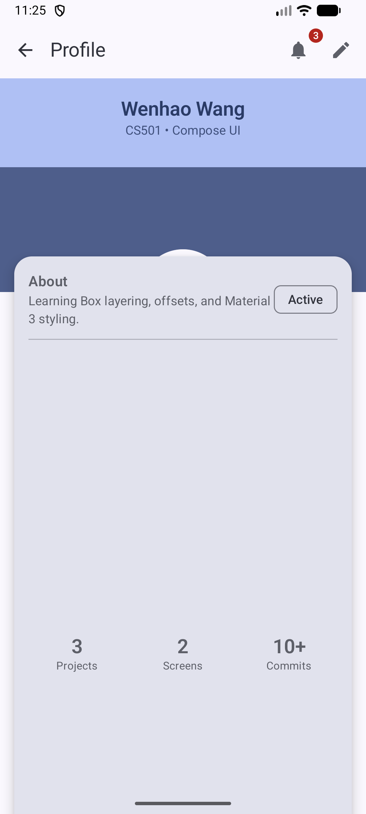
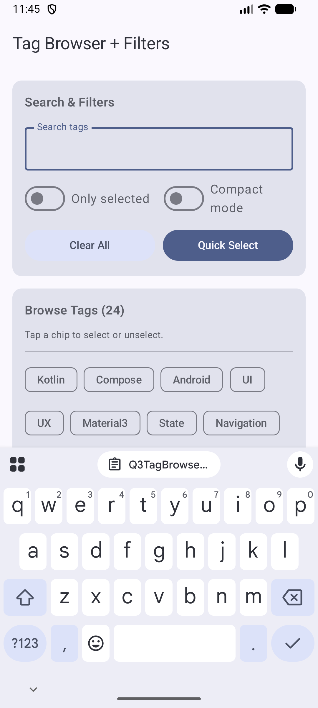

# CS501 - Individual Assignment 3 (Q1–Q3)

This repository contains my solutions for **Individual Assignment 3** in CS501 (Jetpack Compose / Material 3 UI layouts).

## Contents
- **Q1** Row/Column Mastery: Settings Screen
- **Q2** Box Layout: Profile Header + Overlay Card
- **Q3** FlowRow / FlowColumn: Tag Browser + Filters

---

## Project Setup / How to Run

1. Open the project in **Android Studio**
2. Sync Gradle if prompted
3. Run the app on an emulator or physical device
4. `MainActivity.kt` can be switched to display the screen for Q1 / Q2 / Q3 as needed

> Package path used in this project:
> `app/src/main/java/com/example/cs501_ia1/`

---

## Q1 — Row/Column Mastery: Settings Screen

### Goal
Build a polished “Settings” screen using a **Column** as the main layout, and **Row + Column nesting** for each settings row.

### What I implemented
- Main screen uses a **Column**-based structure
- Each settings item is a **Row**
  - **Left side:** label + supporting text (nested Column)
  - **Right side:** interactive control (Switch / Checkbox / Slider / Button)
- Used `Modifier.weight()` to keep text and controls aligned and avoid truncation

### Material 3 components used (6+)
Examples included in this screen:
- `TopAppBar`
- `Card`
- `Switch`
- `Checkbox`
- `Slider`
- `AssistChip`
- `Button`
- `Divider`
- `Text`

### Modifier requirements demonstrated
- `padding(...)`
- `fillMaxWidth()`
- `weight(...)`
- `heightIn(...)` / `sizeIn(...)`
- `align(...)`
- `border(...)` / `clip(...)` / `background(...)` / `clickable(...)` (used for visual polish and interaction)

### Screenshot

---

## Q2 — Box Layout: Profile Header + Overlay Card

### Goal
Create a profile header UI using **Box layering**, including:
- a background header area
- a circular avatar
- an overlay card that partially overlaps the header

### What I implemented
- Used **Box** to layer:
  - background header panel
  - foreground avatar (circle)
  - overlapping profile/info card
- Used `contentAlignment`, `align(...)`, and `offset(...)` to control placement
- Created a classic “profile card over header” layout

### Material 3 components used (5+)
Examples included in this screen:
- `TopAppBar`
- `Card`
- `Icon`
- `Button` / `FilledTonalButton`
- `AssistChip`
- `Surface`
- `Text`

### Modifier requirements demonstrated
- `clip(CircleShape)` for avatar
- `offset(...)` for overlap positioning
- `zIndex(...)` (used where needed to ensure proper layering)
- `CardDefaults.cardElevation(...)` / shadow for depth
- fixed size / `aspectRatio(...)` for avatar and layout elements

### Screenshot

---

## Q3 — FlowRow / FlowColumn: Tag Browser + Filters

### Goal
Build a “Tag Browser” screen where chips wrap nicely across the screen and selection updates dynamically.

### What I implemented
- A **FlowRow** section for a dynamic set of tags (chips) that wraps to new lines automatically
- A second **FlowColumn** section for filter controls / selected items display
- A **Selected Tags** area that updates when chips are tapped (state-based interaction)
- Visual selected state changes for chips (color / border / elevation style)

### Material 3 components used
- `FilterChip` / `AssistChip` (required chip interaction)
- plus at least 4 additional M3 components, such as:
  - `TopAppBar`
  - `Card`
  - `Text`
  - `Button`
  - `Divider`
  - `OutlinedButton` / `SegmentedButton` (depending on final version)

### Modifier requirements demonstrated
- `Arrangement.spacedBy(...)` for consistent spacing
- `fillMaxWidth()` and `padding(...)` for responsive layout
- visual selected state styling (color / elevation / border)
- wrapping layout behavior via `FlowRow` / `FlowColumn`

### Screenshot

---

## File Structure (Relevant Files)

- `app/src/main/java/com/example/cs501_ia1/MainActivity.kt`
- `app/src/main/java/com/example/cs501_ia1/Q1SettingsScreen.kt`
- `app/src/main/java/com/example/cs501_ia1/Q2ProfileScreen.kt`
- `app/src/main/java/com/example/cs501_ia1/Q3TagBrowserScreen.kt`

---

## AI Disclosure

I used ChatGPT as a coding assistant for:
- brainstorming UI structure and Compose layout patterns
- debugging Compose errors (imports, modifiers, layout issues)
- improving README wording and organization

All code was reviewed, integrated, and tested by me in Android Studio before submission.

---

## Submission

GitHub repository link: **(paste your repo link here)**

Example:
`https://github.com/JefferyWenhaoWang/cs501`
